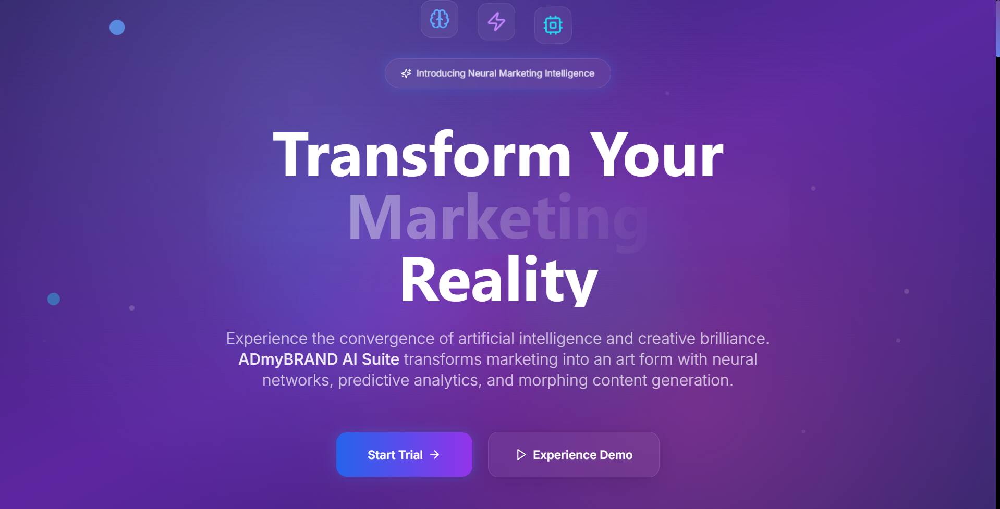

# 🧠 ADmyBRAND AI Suite – Landing Page

> A high-impact, animation-rich landing page for a fictional AI marketing tool. Built with **Next.js 14**, **Tailwind CSS**, and **Framer Motion** — optimized for clarity, performance, and visual storytelling.

---
## https://ad-my-brand-theta.vercel.app/

## 🔍 Project Overview

**ADmyBRAND AI Suite** is a concept landing page showcasing an AI-powered neural marketing tool. This landing page is designed with 2025 design trends: animated gradients, morphing blobs, kinetic transitions, and responsive layouts that blend creative storytelling with functional UI.

---

## 🚀 Features

- ⚡ **Next.js 14** with App Router
- 🎨 **Tailwind CSS** for modern styling
- 🧠 **Framer Motion** for smooth animations
- 💎 **Lucide Icons** for pixel-perfect visuals
- 💡 Sections include:
  - Hero with animated tagline
  - Feature highlights
  - Interactive pricing calculator
  - Testimonials and FAQ
  - Call-to-action & contact
- 🌙 **Dark mode** ready
- 📱 Fully responsive and performance-optimized

---

## 📁 Folder Structure

├── app/
│ ├── layout.tsx
│ ├── page.tsx
│ └── globals.css
├── components/
│ ├── ui/
│ │ ├── Button.tsx
│ │ ├── Card.tsx
│ │ └── ...
│ ├── Hero.tsx
│ ├── Features.tsx
│ ├── PricingCalculator.tsx
│ └── ...
├── public/
├── out/
├── tailwind.config.ts
├── next.config.js
└── README.md

---

## 🛠 Setup Instructions

### 1. Clone the Repository

git clone https://github.com/yourusername/admybrand-landing.git
cd admybrand-landing

### 2. Install Dependencies

npm install

### 3. Run the Dev Server

npm run dev
Visit: http://localhost:3000

### 🌐 Deploying on Vercel
1. Push the project to GitHub
2. Go to https://vercel.com
3. Click New Project → Import from GitHub
4. Accept default settings (Next.js detected automatically)
5. Click Deploy
